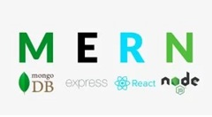
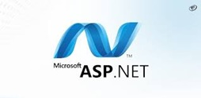
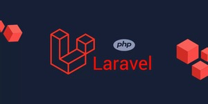

[](https://www.glassgenerator.ca/)

# Hi, I'm Parjad Minooei! 👋

**Full-Stack Web Developer**  
_Building digital dreams, one pixel at a time._


```javascript
const greeting = {
  message: "Hello World!",
  from: "Parjad"
};
```


## 🚀 About Me

- 🎓 Currently studying **Web Development at Humer Polytechnic**
- 💻 Passionate about building web apps and learning new technologies
- 🛠️ Working with **MERN**, **ASP.Net**, **Laravel**, and more


## 🛠️ Skills





## 🧰 Tech Stack


## 🌐 Connect With Me

[](mailto:minooeip@hotmail.com)
[](https://www.linkedin.com/in/parjadminooei/)
[](https://github.com/ParjadM)


## 🏆 Featured Projects

- **[CodeQuest](https://parjadm.github.io/CodeQuest/):** A game to test your JavaScript knowledge.
- **[Binary 1010 Generator](http://binary1010generator.somee.com/):** 1 True & 0 False generator.
- **[Portfolio Website](https://parjadm.github.io/Portfolio/):** My personal portfolio.
- **[SpaceShooter](https://parjadm.github.io/SpaceShooter/):** SpaceShooter
- **[Markdown Profile](https://parjadm.github.io/markdown-portfolio/):** Profile built using Markdown.
- **[My First Blog Post](https://parjadm.github.io/blog-post/):** "Hello World" blog.
- **[E-commerce](https://simple-e-commerce-s3aj.onrender.com/):** Simple E-Commerce Website.
- **[FinanceCalcuator](https://parjadm.github.io/finance-calculator/):** Finance Calculator.


## 📦 Packages

- **[BinaryTextGenerator](https://www.nuget.org/packages/BinaryTextGenerator):**  
  Add with: `dotnet add package BinaryTextGenerator --version 0.5.0`  
  _Note: Tested locally only_


## 📈 GitHub Stats


## 📰 News & Updates

- Working on PixelMarket As **Capstone** [PixelMarket](https://github.com/ParjadM/PixelMarket)
- Working on Wordpress building a portfolio website.
- Available for work contact me if you have any opportunities
- Trying to learn vibe coding since it's the future! :)


## 🎉 Fun

```bash
- Why was the Git commit so cold?
- Because it didn't have any 'pull' requests.
```


```javascript
const farewell = {
  message: "Happy Coding!",
  status: "Always Learning"
};
```


---

### ✨ Follow me on GitHub! 👋

